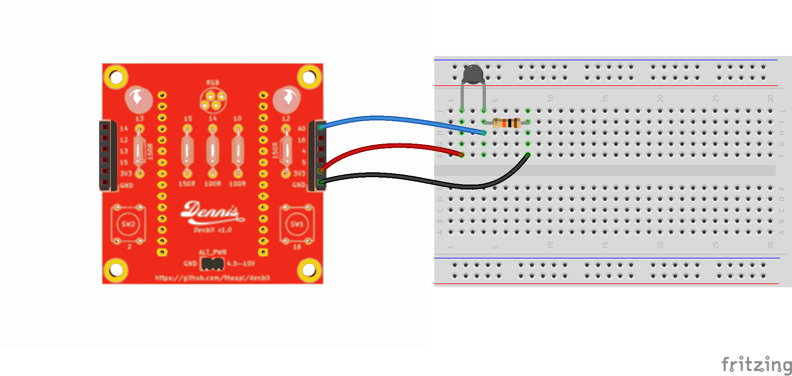

# Temperature

Meassures the temperature and changes the RGB led as appropriate. 

Connect the parts as shown in the image:
- GND to one end of a 10K resistor(Brown - Black - Orange - Gold)
- One leg of the thermistor (temperature sensor) to the other end of the resistor
- 3V3 to the other leg of the thermistor
- A0 to the point where the thermistor & resitor are connected

  (GND) ---- (10k-Resistor) ------- (Analog Pin A0) ------- (Thermistor) ---- (3V3)

### The Temperature sketch
- `File -> Examples -> Denbit -> Sensors -> Temperature`
- Compile the software: click the tick in the top left of the Arduino application... wait while it compiles...
- Upload the software: click the arrow in the top left of the Arduino application... wait while it uploads
